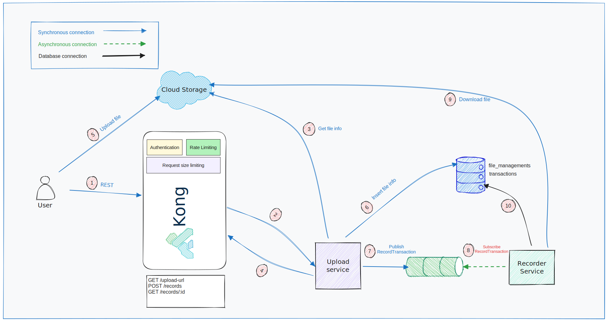
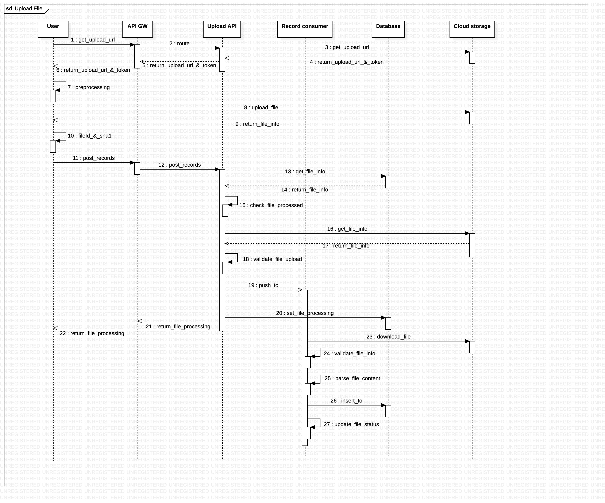

## Bank Reconciliation System

Bank Reconciliation System provides API for client to call via HTTP(s) protocol
to import the transactions

### Technical stack
- Backend
  - **Node.js** as runtime environment
  - **NestJS** as key framework development tool
  - **TypeScript** programming language
  - **nvm** used as Node Version Manager
- Main libraries
  - **csv-parser** used for parse CSV file content
  - **node-xlsx** used for parse Excel file content
  - **sanitize-filename** used for removing directory paths and invalid characters
  - **NestJS** framework used as main framework for this project
- Infrastructure
  - Postgres, RabbitMQ
  - docker and docker-compose
  - Kong API gateway

### Bank Reconciliation System - System architecture



### Bank Reconciliation System - Upload file flow


### Design patterns
- Strategy pattern used for file-processor in recorder

### Best practices
- Rate limit for all route
- Size limit 1MB
- Optimize docker image use multi-stage builds and .dockerignore
- Specific Docker image versions

### Services
No. | Service             | URI
--- |---------------------| ---
1 | api-gateway         | [http://localhost:8000](http://localhost:8000)
2 | upload service      | [http://localhost:3000](http://localhost:3000) (note: when only starting locally)
3 | recorder service    | worker only
4 | postres database    | [localhost:5433](localhost:5433)
5 | rabbitmq management UI | [localhost:15672](localhost:15672)

### Folder structure

```
apps
├── api # responsible for handling incoming requests and returning responses to the client.
└── recorder # recorder consume messages from queues, and insert data into DB
    └── src
        └── file-processor
libs
└── shared # shares features, types, constants, and services used by (micro) services in apps directory
    └── src
        ├── common
        ├── decorators
        ├── entities
        ├── guards
        ├── index.ts
        ├── interfaces
        ├── modules
        ├── services
        └── utils
```

## Bootstrap services

### Use containerized
- NOTE: `docker` and `docker-compose` installed
```shell
PORT=8000
docker-compose up -d --build
```

### Local machine
- Install dependencies
```bash
PORT=3000
$ yarn install
```

### Running the app

```bash
# development
$ yarn run start

# watch mode
$ yarn run start:dev

# production mode
$ yarn run start:prod
```

## Test upload file
- Prerequisites
```shell
PORT=8000 # docker
CID=f5a7065f-8406-430d-8737-db13019790d3
API_KEY=3954a858-a4c5-476b-bd37-15a460f06e12
```

### Use script (recommend)
- Step 1: Upload file
```shell
 node ./scripts/client-test.js upload_file <filePath>
```

- Step 2: Check file process status by `fileId` response from **Step 1**
```shell
node ./scripts/client-test.js get_file <fileId>
```

### Use CURL commands


- Step 1: Get upload url
```shell
curl --location "localhost:$PORT/upload-url" \
-H "x-consumer-id: $CID" \
-H "x-api-key: $API_KEY"


# Response structure
#{
#    "status": "success",
#    "uploadUrl": "https://pod-050-1000-12.backblaze.com/b2api/v2/b2_upload_file/ee19929c870eebfd809b0411/c005_v0501000_t0033",
#    "token": "4_005e92c7ebd0b410000000002_01aeb976_f8751a_upld_Aythfbu6GS38Z0pYx_aFqHYnXfM=",
#    "message": "Note: Only supported Excel or CSV files"
#}
```

- Step 2: Upload file to B2 by `uploadUrl` and `token` response from **Step 1**
```shell
FILE_TO_UPLOAD=<filePath> # Name and URL of the file to upload
MIME_TYPE=b2/x-auto # Mime type of the file. X-auto can also be leveraged.
SHA1_OF_FILE=$(openssl dgst -sha1 $FILE_TO_UPLOAD | awk '{print $2;}') # SHA1 of the file
UPLOAD_URL=<uploadUrl> # From the b2_get_upload_url call
UPLOAD_AUTHORIZATION_TOKEN=<token> # From the b2_get_upload_url call

curl \
    -H "Authorization: $UPLOAD_AUTHORIZATION_TOKEN" \
    -H "X-Bz-File-Name: $FILE_TO_UPLOAD" \
    -H "Content-Type: $MIME_TYPE" \
    -H "X-Bz-Content-Sha1: $SHA1_OF_FILE" \
    -H "X-Bz-Info-Author: unknown" \
    --data-binary "@$FILE_TO_UPLOAD" \
    $UPLOAD_URL
```

- Step 3: Send a request to records API by `fileId` and `contentSha1` response from **Step 2**
```shell
curl --location "localhost:$PORT/records" \
-H "x-api-key: $API_KEY" \
--data '{
    "fileId": <fileId>,
    "sha1": <contentSha1>
}'
```

- Step 4: Check file process status by `fileId`
```shell
curl --location "localhost:$PORT/records/<fileId>" \
-H "x-consumer-id: $CID" \
-H "x-api-key: $API_KEY"
```

### Development conventions
- [Coding guidelines](https://github.com/microsoft/TypeScript/wiki/Coding-guidelines)
- [Commit message guidelines](https://github.com/nestjs/nest/blob/bf0768ed4bb965eb19528460534749ddcd02e3f1/CONTRIBUTING.md#commit)
